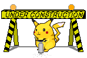
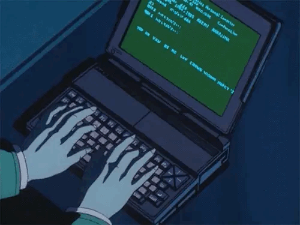
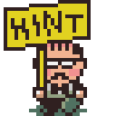
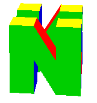

# Web Workshop 🚧

Craft handmade websites in their natural habitat (your web browser).

<a href="https://hunterirving.github.io/web_workshop/">
</a><br><br>

Web Workshop was born as a teaching tool for web development classes, with the goal of making web publishing more accessible, especially to those who have never written code before.

By stripping away complexity and focusing on the basics, Web Workshop turns website building into something playful and toylike – a creative playground where you can experiment, break things, and watch your ideas materialize in real-time.

<a href="https://hunterirving.github.io/web_workshop/">
</a>
<br><br>

Recently, Web Workshop has become an editor of choice for <a href="https://html.energy/html-day/2025/index.html">HTML Day</a>, an annual celebration of handmade websites and the creative web.

## Built with Web Workshop
- [Hunter's Club-Mate Fan Club](https://hunterirving.github.io/web_workshop/pages/club-mate) - A shrine to the beloved hacker beverage
- [Hunter's Trinket Collection](https://hunterirving.github.io/web_workshop/pages/trinkets) - A virtual museum to house five cherished tchotchkes
- [SNAKE](https://hunterirving.github.io/web_workshop/pages/snake) - The classic game, reimagined for the modern era
- [Jenno's Picnic World](https://hunterirving.github.io/web_workshop/pages/jennos_picnic_world) - An interactive digital collage

## How to Play

1. Open `index.html` in your web browser (<a href="https://hunterirving.github.io/web_workshop/">click here</a>!)
2. Type some HTML in the editor pane
    - The preview pane will rerender when you're done typing
    - Your work is automatically saved, and restored when you reload the page
3. Press `⌘ + S` to export your work as an HTML file (`⌘ + O` to open an existing file)



## Boilerplate
Type `<!>` to insert the following starter HTML:

```html
<!DOCTYPE html>
<html>
	<head>
		<style>
			
		</style>
	</head>
	<body>
		
	</body>
</html>
```

## Stock Images
A library of stock images is included for your convenience. To browse them, type `` anywhere in the editor pane, then click to select an image from the resulting table.

<a href="https://hunterirving.github.io/web_workshop/">
</a>
<br><br>

Alternatively, if you know the name of the image you'd like to use, you can add it to your project like so: ``.


## Built-in Fonts
A collection of free fonts is also included. In your CSS (style tag or inline styling), type `font-family:` to preview what's available. Use <kbd>↑</kbd> / <kbd>↓</kbd> to navigate the list, and press <kbd>Enter</kbd> to select the one you want.

```html
<style>
	h1 { font-family: 'Basteleur Bold'; }
</style>
```

<details>
<summary>available font families...</summary>

| font-family | variants | license |
|-------------|----------|---------|
| `Baskervville` | Regular, Italic, Bold, Bold Italic | [SIL Open Font License](resources/fonts/baskervvile/OFL.txt) |
| `Baskervville SemiBold` | Regular, Italic | [SIL Open Font License](resources/fonts/baskervvile/OFL.txt) |
| `Basteleur Bold` | Regular | [SIL Open Font License](resources/fonts/basteleur-master/LICENSE.txt) |
| `Basteleur Moonlight` | Regular | [SIL Open Font License](resources/fonts/basteleur-master/LICENSE.txt) |
| `Avara` | Bold, Bold Italic | [SIL Open Font License](resources/fonts/Avara-master/LICENSE.txt) |
| `Avara Black` | Regular | [SIL Open Font License](resources/fonts/Avara-master/LICENSE.txt) |
| `Ballet` | Regular | [SIL Open Font License](resources/fonts/Ballet/OFL.txt) |
| `Bitcount Single` | Regular | [SIL Open Font License](resources/fonts/Bitcount_Single/OFL.txt) |
| `Cut Me Out 2` | Regular | [SIL Open Font License](resources/fonts/CutMeOut/Open%20Font%20License.txt) |
| `Elb-Tunnel` | Regular | [Creative Commons](resources/fonts/ElbtunnelTT/Creative%20Commons%20Lizenz.txt) |
| `Elb-Tunnel Schatten` | Regular | [Creative Commons](resources/fonts/ElbtunnelTT/Creative%20Commons%20Lizenz.txt) |
| `Eagle Lake` | Regular | [SIL Open Font License](resources/fonts/Eagle_Lake/OFL.txt) |
| `Eureka` | Regular | [SIL Open Font License](resources/fonts/Eureka/Open%20Font%20License.txt) |
| `Feroniapi` | Medium Italic | [SIL Open Font License](resources/fonts/feroniapi-main/LICENSE.txt) |
| `Geostar Fill` | Regular | [SIL Open Font License](resources/fonts/Geostar_Fill/OFL.txt) |
| `Hyper Scrypt` | Regular | [SIL Open Font License](resources/fonts/Hyper-Scrypt-master/LICENSE.txt) |
| `IBM Plex Serif` | Regular, Italic, Bold, Bold Italic | [SIL Open Font License](resources/fonts/IBM_Plex_Serif/OFL.txt) |
| `Indira K` | Regular | [SIL Open Font License](resources/fonts/Indira_K/OFL.txt) |
| `Instrument Serif` | Regular, Italic | [SIL Open Font License](resources/fonts/Instrument_Serif/OFL.txt) |
| `Jacquard 12` | Regular | [SIL Open Font License](resources/fonts/Jacquard_12/OFL.txt) |
| `Jacquarda Bastarda 9` | Regular | [SIL Open Font License](resources/fonts/Jacquarda_Bastarda_9/OFL.txt) |
| `Jgs Font` | Regular | [SIL Open Font License](resources/fonts/jgs-main/LICENSE) |
| `Jgs 5` | Regular | [SIL Open Font License](resources/fonts/jgs-main/LICENSE) |
| `Jgs 7` | Regular | [SIL Open Font License](resources/fonts/jgs-main/LICENSE) |
| `Jgs 9` | Regular | [SIL Open Font License](resources/fonts/jgs-main/LICENSE) |
| `Kaeru Kaeru` | Regular | [SIL Open Font License](resources/fonts/kaerukaeru-master/LICENSE.txt) |
| `Kanalisirung` | Regular | [SIL Open Font License](resources/fonts/Kanalisirung/OFL.txt) |
| `Karrik` | Regular, Italic | [SIL Open Font License](resources/fonts/karrik_fonts-main/LICENCE.txt) |
| `Kings` | Regular | [SIL Open Font License](resources/fonts/Kings/OFL.txt) |
| `Matemasie` | Regular | [SIL Open Font License](resources/fonts/Matemasie/OFL.txt) |
| `Mess` | Light | [SIL Open Font License](resources/fonts/Mess-master/licence.txt) |
| `Mon Hugo` | Regular | [SIL Open Font License](resources/fonts/Mon_Hugo_freefont/FREE%20FONT%20LICENSE.txt) |
| `Mon Hugo Out` | Regular | [SIL Open Font License](resources/fonts/Mon_Hugo_freefont/FREE%20FONT%20LICENSE.txt) |
| `Murrx` | Regular | [SIL Open Font License](resources/fonts/Murrx/Open%20Font%20License.txt) |
| `Neo-castel` | Regular | [OIFL (French OFL)](resources/fonts/Neo-castel/Licence.txt) |
| `Ouest` | Regular | [OIFL (French OFL)](resources/fonts/OUEST/license.txt) |
| `Princess Sofia` | Regular | [SIL Open Font License](resources/fonts/Princess_Sofia/OFL.txt) |
| `Resistance` | Regular | [SIL Open Font License](resources/fonts/resistance-generale-master/LICENSE.txt) |
| `Snowburst One` | Regular | [SIL Open Font License](resources/fonts/Snowburst_One/OFL.txt) |
| `Special Elite` | Regular | [Apache License](resources/fonts/Special_Elite/LICENSE.txt) |
| `Special Gothic Expanded One` | Regular | [SIL Open Font License](resources/fonts/Special_Gothic_Expanded_One/OFL.txt) |
| `Steps Mono` | Regular | [SIL Open Font License](resources/fonts/steps-mono-main/LICENSE.txt) |
| `Steps Mono Thin` | Regular | [SIL Open Font License](resources/fonts/steps-mono-main/LICENSE.txt) |
| `Terminal Grotesque` | Regular | [SIL Open Font License](resources/fonts/Terminal-Grotesque-master/LICENSE.md) |
| `Terminal Grotesque Open` | Regular | [SIL Open Font License](resources/fonts/Terminal-Grotesque-master/LICENSE.md) |
| `Tiny5` | Regular | [SIL Open Font License](resources/fonts/Tiny5/OFL.txt) |
| `Trickster` | Regular | [SIL Open Font License](resources/fonts/Trickster-master/LICENSE.txt) |

</details>

## Options
- to toggle <b>line numbers</b>, press <kbd>F1</kbd> (disabled by default)
- to toggle <b>line wrapping</b>, press <kbd>F2</kbd> (enabled by default)

## Installation for Offline Use

<i>
Wanna make websites on your phone? Try installing Web Workshop as a <a href="https://hunterirving.github.io/web_workshop/pages/pwa">Progressive Web App</a>!</i><br><br><small>(You can install it as a desktop app, too...)</small>

## Technologies Used

- [CodeMirror 6](https://codemirror.net/)
- [GitHub Dark Theme for CodeMirror](https://github.com/fsegurai/codemirror-themes)


## License

GPLv3 (see <a href="LICENSE">LICENSE</a> for details).

<br>


## Contributing

Feel free to open issues or submit pull requests for improvements!


